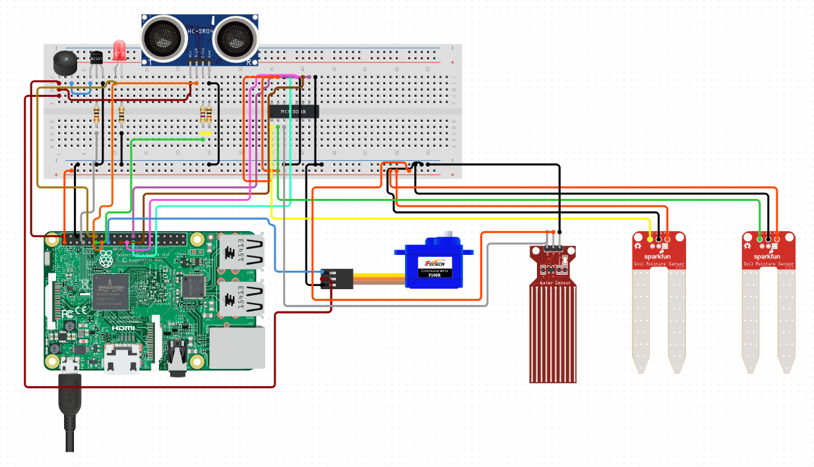

# es-project
Embedded Systems Course Project

- Parsa Mohammadian - 98102284

- Kasra Amani - 98101171

- Reza Erfan - 98105919

- Kahbod Aeini - 98101209

## Introduction
The main idea is creating a smart water container using a proximity sensor to detect user requests and water level sensors to keep track of the water supply's level.
## Requirments
### Hardware
The project is initially implemented on following hardwares but it may work on similar hardwares:
- Raspberry pi 3b+

### Software
- Python 3.0 (Tested on Python 3.9)
- Raspbian
- Django

## Wiring Harness
The general components wiring is similar to wiring in the schematic bellow.

The exact wiring and gpio ports are defined as constants in python files in `Modules` directory.

## Embedded System Design and Logic
The project contains multiple python modules including water, ultrasonic distance, buzzer, actuator and LED; these modules each contain methods and classes reagarding the specific section of the ES and when creating the main module integrating all of them together, we have used these modules to operate the actuator and buzzer. 

## How to Run
The project consists of two main parts. First you should run the web app in order to show coleman info in raspberry pi or any device in local network.
```bash
python "ES WebApp/ES_WebApp/manage.py" runserver 0.0.0.0:8000
```
Then the web app will be accessible on `<raspberry pi ip address>:8000`.
Second you should run the `main.py` file which reads sensors, process data, and activate actuators.
```bash
python Modules/main.py`
```
## Test and Performance
Watch [working system video](./Documentation/Report.MOV).
